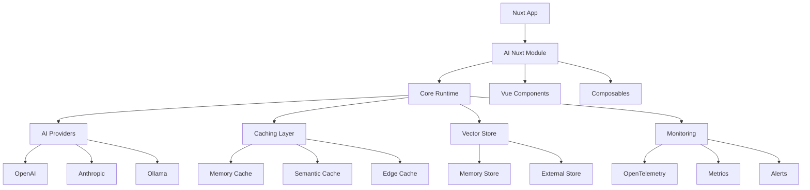

# AI Nuxt 🤖

> The complete AI framework for Nuxt.js applications

[](https://npmjs.com/package/@ai-nuxt/module)
[](https://npmjs.com/package/@ai-nuxt/module)
[](https://opensource.org/licenses/MIT)

AI Nuxt is a comprehensive AI framework built on top of Nuxt.js that brings unified AI capabilities to Vue.js developers. It provides a zero-configuration, developer-friendly solution for integrating various AI providers (OpenAI, Anthropic, Ollama) into Nuxt applications with features like streaming responses, caching, vector stores, multi-agent systems, and advanced UI components.

## ✨ Features

- 🔌 **Multiple AI Providers** - OpenAI, Anthropic, Ollama support
- 🚀 **Edge Runtime** - Deploy to Cloudflare, Vercel, Netlify
- 💬 **Streaming Chat** - Real-time AI conversations
- 🧠 **Vector Storage** - RAG and semantic search
- 🤖 **AI Agents** - Multi-agent orchestration
- 📊 **Monitoring** - OpenTelemetry integration
- 🎨 **Vue Components** - Pre-built AI UI components
- ⚡ **Caching** - Intelligent response caching
- 🔒 **Security** - Built-in safety features
- 📱 **TypeScript** - Full type safety

## 🚀 Quick Start

### Installation

```bash
npm install @ai-nuxt/module
```

### Basic Setup

```typescript
// nuxt.config.ts
export default defineNuxtConfig({
  modules: ['@ai-nuxt/module'],
  
  aiNuxt: {
    providers: {
      openai: {
        apiKey: process.env.OPENAI_API_KEY
      }
    }
  }
})
```

### Environment Variables

```bash
# .env
OPENAI_API_KEY=your-openai-api-key
ANTHROPIC_API_KEY=your-anthropic-api-key
```

### Your First AI Chat

```vue
<template>
  <div>
    <AIChat />
  </div>
</template>
```

That's it! You now have a fully functional AI chat interface.

## 📖 Documentation

### Core Concepts

- [**Getting Started**](./docs/getting-started.md) - Installation and basic setup
- [**Configuration**](./docs/configuration.md) - Complete configuration guide
- [**AI Providers**](./docs/providers.md) - Working with different AI services
- [**Composables**](./docs/composables.md) - Vue composables reference
- [**Components**](./docs/components.md) - Pre-built UI components

### Advanced Features

- [**Streaming**](./docs/streaming.md) - Real-time AI responses
- [**Caching**](./docs/caching.md) - Performance optimization
- [**Vector Storage**](./docs/vector-storage.md) - RAG and embeddings
- [**AI Agents**](./docs/agents.md) - Multi-agent systems
- [**Monitoring**](./docs/monitoring.md) - Observability and analytics

### Deployment

- [**Edge Deployment**](./docs/edge-deployment.md) - Deploy to edge platforms
- [**Production**](./docs/production.md) - Production best practices
- [**Security**](./docs/security.md) - Security considerations

### Examples

- [**Chat Application**](./examples/chat-app/) - Complete chat app
- [**RAG System**](./examples/rag-system/) - Document Q&A
- [**AI Agents**](./examples/ai-agents/) - Multi-agent workflows
- [**Edge Deployment**](./examples/edge-deployment/) - Edge platform examples

## 🎯 Use Cases

### 💬 Chat Applications
Build intelligent chatbots and conversational interfaces with streaming support and conversation management.

### 📚 Document Q&A
Create RAG systems that can answer questions about your documents using vector search and embeddings.

### 🤖 AI Agents
Develop autonomous agents that can use tools, communicate with each other, and execute complex workflows.

### 🔍 Semantic Search
Implement semantic search functionality with vector embeddings and similarity matching.

### 📊 Content Generation
Generate and analyze content using various AI models with caching and optimization.

## 🏗️ Architecture



## 🛠️ Development

### Prerequisites

- Node.js 16+
- pnpm (recommended)

### Setup

```bash
# Clone the repository
git clone https://github.com/ai-nuxt/ai-nuxt.git
cd ai-nuxt

# Install dependencies
pnpm install

# Build packages
pnpm build

# Run tests
pnpm test

# Start development
pnpm dev
```

### Project Structure

```
ai-nuxt/
├── packages/
│   ├── @ai-nuxt/core/          # Core runtime and utilities
│   ├── @ai-nuxt/module/        # Nuxt module
│   ├── @ai-nuxt/cli/           # Command-line interface
│   ├── @ai-nuxt/devtools/      # Development tools
│   └── @ai-nuxt/ui/            # UI components library
├── examples/                   # Example applications
├── docs/                       # Documentation
└── playground/                 # Development playground
```

## 🤝 Contributing

We welcome contributions! Please see our [Contributing Guide](./CONTRIBUTING.md) for details.

### Development Workflow

1. Fork the repository
2. Create a feature branch
3. Make your changes
4. Add tests
5. Submit a pull request

## 📄 License

[MIT License](./LICENSE) - see the [LICENSE](./LICENSE) file for details.

## 🙏 Acknowledgments

- [Nuxt.js](https://nuxt.com/) - The amazing Vue.js framework
- [OpenAI](https://openai.com/) - AI API provider
- [Anthropic](https://anthropic.com/) - Claude AI provider
- [Ollama](https://ollama.ai/) - Local AI models

## 📞 Support

- 📖 [Documentation](https://ai-nuxt.dev)
- 💬 [Discord Community](https://discord.gg/ai-nuxt)
- 🐛 [Issue Tracker](https://github.com/ai-nuxt/ai-nuxt/issues)
- 📧 [Email Support](mailto:support@ai-nuxt.dev)

---

<p align="center">
  <strong>Built with ❤️ for the Vue.js community</strong>
</p>